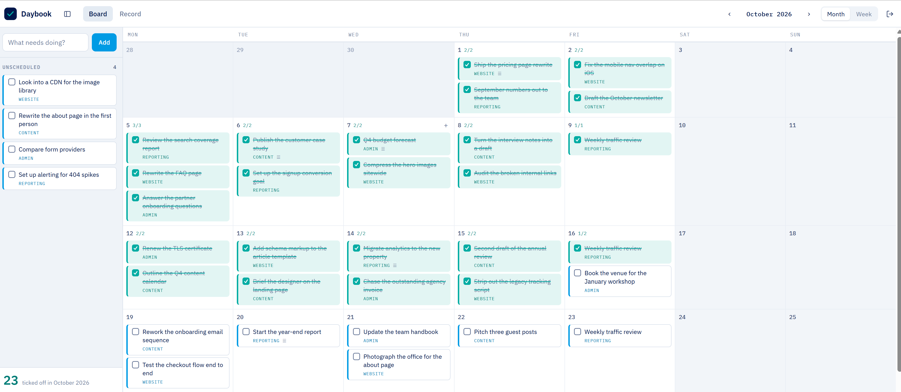

# Donebook

A task board that keeps the record.

**[Try the demo →](https://donebook.crmckgsb.com)** (password `demo`; it is a shared sandbox and wipes hourly)

[](https://github.com/Jduckworp/donebook/releases/latest)
[](https://hub.docker.com/r/jduckworp/donebook)
[](https://hub.docker.com/r/jduckworp/donebook)
[](https://pypi.org/project/donebook/)
[](LICENSE)



Schedule tasks onto days, drag them around, tick them off. The difference
from every other todo app is what happens next: **nothing you finish is ever
thrown away.** At the end of the month you can export exactly what got done,
grouped by workstream or as a chronology — the thing you actually need when
someone asks what you have been working on.

Single user, single password, one SQLite file, no accounts, no cloud, no
telemetry. About 1,600 lines of Python and vanilla JavaScript, plus a
stylesheet — no build step, no frontend framework, no npm.

## Why

Todoist and its relatives are built around the idea that a completed task is
finished business — it disappears, or it goes into an archive you will never
open. That is fine if a todo list is all you want. It is useless if you also
need to answer "what did I do in September?", which for a lot of people comes
round every month.

Donebook treats the completed task as the point. Ticking something is not
deletion, it is a dated entry in a record that you can read back, export and
hand to somebody.

## What it does

- **Month or week board.** The same board either way; week gives full-height
  day columns. Below 900px it collapses to a single scrolling column of days,
  which is the layout that works on a phone.
- **An Unscheduled rail** for things not yet committed to a date. Drag onto a
  day to schedule, drag back to take it off the calendar.
- **Workstreams** (`strand`) — free text, used to group the monthly record.
- **The record.** Pick a month, then copy it as Markdown, or download `.md`
  or `.csv`. Grouped by workstream by default, which is usually the shape a
  report to management wants; switch to by-day for a chronology.
- **Installs to a home screen** as a PWA, and the last board you loaded stays
  readable when you go offline. Signing out drops that cached copy, so the
  next person to pick the phone up cannot read it without the password.

Three rules keep the record honest:

- Ticking a task stamps `completed_at` with the **browser's local time**, so
  the record matches the day you actually worked, whatever timezone the
  server thinks it is in.
- Deleting is a soft delete. The task leaves the board, but if it had been
  ticked it still counts toward that month's record.
- Ticking something straight off the Unscheduled rail files it under today,
  so unplanned work still lands in the record.

## Install

### Docker (recommended)

Published for `linux/amd64` and `linux/arm64`, so this works on a Raspberry Pi
and an Apple Silicon Mac as well as an x86 server. Nothing to clone:

```bash
docker run -d --name donebook \
  -p 8765:8765 \
  -v donebook-data:/data \
  -e DONEBOOK_INSECURE_COOKIE=1 \
  jduckworp/donebook:1

docker logs donebook | grep -A2 "first boot"
```

Or with Compose — copy [`compose.yaml`](compose.yaml) and run `docker compose
up -d`, then `docker compose logs | grep -A2 "first boot"`.

Open <http://localhost:8765> and sign in with the password from that log line.
It is generated on first boot and also written to `config.json` on the volume.
Change it once you are in (see below).

Tags: `1` tracks the latest 1.x, `1.0.0` pins an exact build, `latest` is
whatever is newest. Pin the major at least.

The database and the password both live on the `donebook-data` volume, so
`docker compose down` and an upgrade lose nothing. Back it up by copying
`donebook.db` out of the volume:

```bash
docker cp donebook:/data/donebook.db ./donebook-backup.db
```

### From PyPI

```bash
pipx install donebook
donebook --insecure-cookie
```

`pip install donebook` works too. The database and config land in **the
directory you run it from** — `./data/donebook.db` and `./config.json` — so
run it somewhere you mean to keep, or pass `--data-dir`. `donebook --help`
lists the flags; `--insecure-cookie` is only needed until TLS is in front.

### From a clone

Requires Python 3.10+.

```bash
git clone https://github.com/Jduckworp/donebook.git
cd donebook
python3 -m venv .venv
.venv/bin/pip install -e .
.venv/bin/donebook --insecure-cookie
```

Same first-boot behaviour in every case: the generated password is printed to
the console and written to `config.json`.

## Deploy

`deploy/` has a systemd unit and an nginx server block to copy and edit, for
running it directly rather than in a container. Either way the shape is the
same: bind it to localhost, put a reverse proxy in front to terminate TLS,
and let the session cookie stay `Secure`.

**If you are using Docker, delete the `DONEBOOK_INSECURE_COOKIE` line from
`compose.yaml` once TLS is in front.** It ships set so that a first run on a
LAN address works at all — without it the browser refuses to send the cookie
back over plain HTTP and you appear signed out on every request. Donebook says
so in its log on every boot while that flag is on.

```bash
sudo cp deploy/donebook.service /etc/systemd/system/
sudo systemctl daemon-reload && sudo systemctl enable --now donebook
```

Donebook has **one password and no user accounts**. Do not put it on a public
hostname without TLS, and think twice before putting it on a public hostname
at all — a private network or a VPN such as Tailscale is a better fit for
what this is.

Failed logins are rate limited: five wrong passwords close the door for a
minute, and the wait doubles with each further attempt up to an hour.

### Configuration

| Variable | Default | Meaning |
|---|---|---|
| `DONEBOOK_DATA_DIR` | `./data` (`/data` in Docker) | Where `donebook.db` lives |
| `DONEBOOK_CONFIG` | `./config.json` (`/data/config.json` in Docker) | Session key, salt, password hash |
| `DONEBOOK_INSECURE_COOKIE` | unset | Set to `1` to allow the session cookie over plain HTTP |

`config.json` is written mode 600 and must stay out of version control —
it is in `.gitignore` already.

### Changing the password

In Docker:

```bash
docker compose exec donebook python -c "
import json, pathlib
from app import hash_password
f = pathlib.Path('/data/config.json')
cfg = json.loads(f.read_text())
cfg['password_hash'] = hash_password('YOUR NEW PASSWORD', cfg['salt'])
cfg.pop('initial_password', None)
f.write_text(json.dumps(cfg, indent=2))
"
docker compose restart donebook
```

Running it directly:

```bash
.venv/bin/python - <<'PY'
import json, pathlib
from app import hash_password
cfg = json.loads(pathlib.Path("config.json").read_text())
cfg["password_hash"] = hash_password("YOUR NEW PASSWORD", cfg["salt"])
cfg.pop("initial_password", None)
pathlib.Path("config.json").write_text(json.dumps(cfg, indent=2) + "\n")
PY
sudo systemctl restart donebook
```

Existing sessions survive, because they are signed with `secret_key`, not the
password. Rotate `secret_key` too if you want to sign everyone out.

## The data is yours

One SQLite table, no ORM, no migrations framework. Read the record without
the app whenever you like:

```bash
sqlite3 data/donebook.db \
  "SELECT completed_at, strand, title, notes FROM tasks
   WHERE done = 1 AND completed_at LIKE '2026-09%'
   ORDER BY completed_at;"
```

In Docker the same file is at `/data/donebook.db` inside the container, or copy
it out with `docker cp donebook:/data/donebook.db .` and query it locally.

| column | meaning |
|---|---|
| `title` / `notes` | the task, and the detail that lands in the report |
| `strand` | workstream, free text, groups the monthly record |
| `day` | `YYYY-MM-DD`, or `NULL` for the Unscheduled rail |
| `pos` | order within a day; rewritten on every drop |
| `done` / `completed_at` | the record. `completed_at` is local time |
| `deleted_at` | soft delete; ignored by the report |

Back it up by copying the file. That is the whole backup story.

## Keyboard and gestures

- **`/`** focuses the quick-add box, **Esc** closes the detail panel.
- The period label doubles as a "jump to today" button.
- Mouse drags start on movement; touch needs a short press first, so a flick
  still scrolls the list rather than picking a card up.

## Theming

Every colour is a custom property on `:root` at the top of
`static/app.css`. Override that block and nothing else to reskin the app.

## Contributing

Issues and pull requests are welcome. It is a small, deliberately
unambitious app — the aim is a tool that still works unchanged in ten years,
so proposals that add a build step, a framework or a second service are
unlikely to land.

## Licence

MIT. See [LICENSE](LICENSE).
